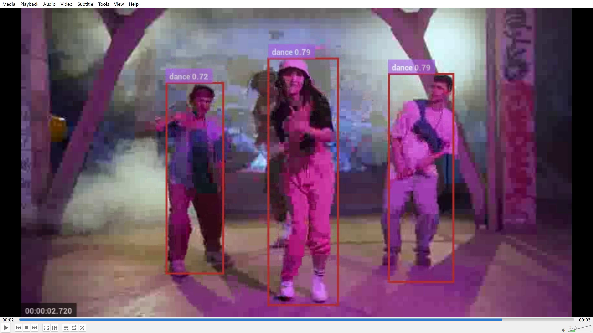

# Long-Term Multi-Person Action Recognition & Tracking (MOT Project)


This project reproduces and runs the **AlphAction** framework for long-term multi-person action recognition and tracking using GPU acceleration via Docker.
The system performs:

- ✅ Person detection (YOLO-based tracking)
- ✅ Multi-object tracking
- ✅ Temporal feature extraction
- ✅ Action classification (AVA-style action labels)
- ✅ Video rendering with bounding boxes + predicted actions

---

## 🚀 Environment (Reproducible Setup)

This project runs inside Docker with:

- Python 3.7
- PyTorch 1.4.0
- CUDA 10.1
- cuDNN 7
- Ubuntu 18.04

⚠️ **Important:** This repository depends on legacy PyTorch APIs. Newer versions of PyTorch (≥1.10) will break due to `Conv3D` API changes.

---

## 🐳 Docker Usage

### 1️⃣ Build the Image

```bash
docker compose build --no-cache
```

- When you build always run pip install -e . inside the project directory to update the package.
- If you want to run the demo, make sure to copy the test video and config files into the container or mount them as volumes. 
The paths in the command below assume they are located in the parent directory of the project inside the container. 
Adjust paths as needed based on your setup.

### 2️⃣ Run the Container

```bash
python3 demo.py \
    --video-path test_video_3s_480p.mp4 \
    --output-path output_3s.mp4 \
    --cfg-path ../config_files/resnet101_8x8f_denseserial.yaml \
    --weight-path ../data/models/aia_models/resnet101_8x8f_denseserial.pth

```


